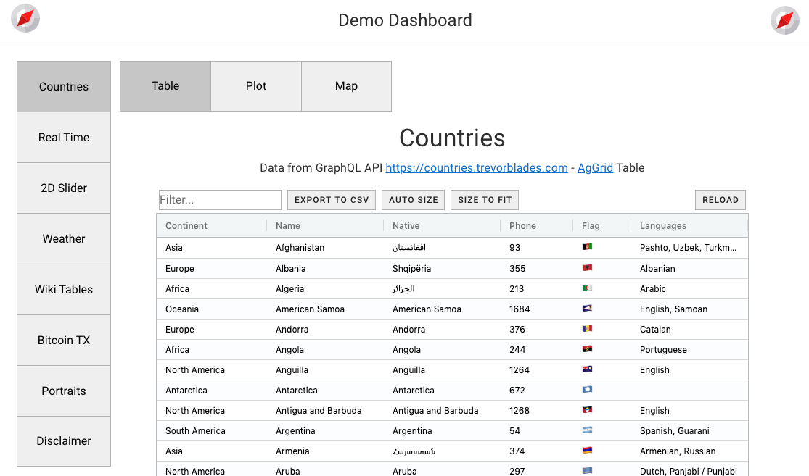
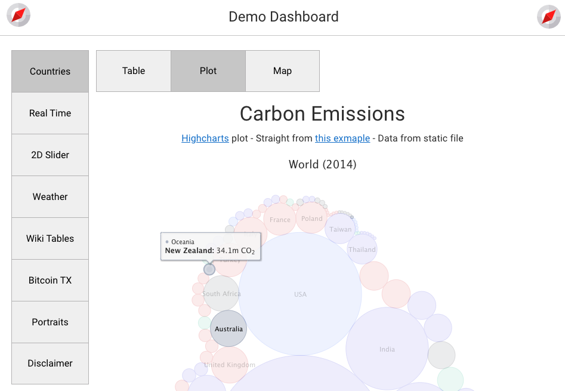

# Overview

As a preamble you may read the introductory [Dashboarding with Nuxt/vue](https://medium.com/@olivier.borderies/dashboarding-with-nuxt-vue-5b3bb0fc048e) medium article.

## Motivation

The [nuxt-dashboard-template](https://github.com/oscar6echo/nuxt-dashboard-template) github repo contains is [Nuxt](https://nuxtjs.org/)-based sample [single page application](https://en.wikipedia.org/wiki/Single-page_application) (SPA) meant to ease the building of dashboards by engineers who, like me, are not non professional web developers.

Its layout features:

- A top bar - typically with organization logo and menu
- A footer - typically with contact info
- A main area organized in a 2-level tab structure:
  - Top level tabs on the left
  - Sub-tabs at the top

See the [demo dashboard](https://oscar6echo.github.io/nuxt-dashboard-template/) - vuetify version.  
Or `git clone` and run locally - bootstrap version. See [Get Started section](./start).

<figure style="text-align: center;">
    
    <figcaption>1st level tabs: Left - 2nd level tabs: Top</figcaption>
</figure>

<figure style="text-align: center;">
    
    <figcaption>Sample tab</figcaption>
</figure>

As opposed to many existing solutions typically wrapping Javascript in Python, the approach presented here does not shy away from direct contact with Javascript.  

As a consequence the learning curve is undoubtedly steeper.  

On the other hand it cannot lead to a dead end as is often the case with quick-win solutions outgrowing their natural scope, like bad weeds in a garden. Think of the impact of bloated Excel sheets in organizations.

However the hurdle is not so high either.  

The [Nuxt](https://nuxtjs.org/) framework greatly simplifies the development work, is well documented and has a large community. It is based on [Vuejs](https://vuejs.org/), one of the dominant 3 Javascript frameworks for web dev: [React](https://reactjs.org/) (from Facebook), [Vue](https://vuejs.org/) (independent), [Angular](https://angular.io/) (from Google). Among these Vue is arguably the most approachable by non-specialists, and its documentation is extremely clear. Additionally the [150k+ github stars](https://github.com/vuejs/vue) are a sign that developers do not find it unpleasant to use, a key point in this context.

Additionally the **nuxt-dashboard-template** should guide the development initial steps - a daunting barrier to non-specialists - so that time and energy can be spent on content i.e. Vue components displayed in tabs / sub-tabs (**"user components"**).  
For this too, the various examples in the demo dashboard may help - hopefully.

## Features

The [nuxt-dashboard-template](https://github.com/oscar6echo/nuxt-dashboard-template) started out as a regular Nuxt app - built with the official [create-nuxt-app](https://github.com/nuxt/create-nuxt-app). Then it was completed to offer the following features:

- 1 or 2-level tab layout  
  So that a developer can cram a decent amount of data without scroll
- Routing among tabs/sub-tabs  
  So that a developer only focuses on the content to display
- App state management in url  
  So that a shared url leads a user right into a specific tab/sub-tab in a specific state
- A store to manage
    - the routing state
    - any user component state
- Demo (same) dashboards in 2 major CSS frameworks:
  - [vuetify](https://vuetifyjs.com/en/)
  - [bootstrap](https://getbootstrap.com/)

## Examples

Most dashboard retrieve data and display tables or graphs.  
To help with these typical use cases the demo dashboards contain user components that:

  - Request REST APIs with [axios](https://axios.nuxtjs.org/) and [fetch](https://developer.mozilla.org/en-US/docs/Web/API/Fetch_API)
  - Request GraphQL API with [apollo](https://github.com/nuxt-community/apollo-module)
  - Load static files with [axios](https://axios.nuxtjs.org/)
  - Connect to [Web Socket](https://developer.mozilla.org/en-US/docs/Web/API/WebSockets_API) for real time data feed
  - Display grid/table with [ag-grid](https://www.ag-grid.com/)
  - Display plots/graphs with [highcharts](https://www.highcharts.com/)
  - Use browser APIs ([geolocalisation](https://developer.mozilla.org/en-US/docs/Web/API/Geolocation_API), [canvas](https://developer.mozilla.org/en-US/docs/Web/API/Canvas_API), [worker](https://developer.mozilla.org/en-US/docs/Web/API/Web_Workers_API))

