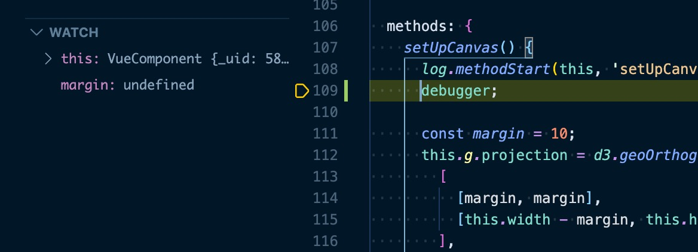

# Debug


To debug the most immediate is to add `console.log(obj)` or `console.log(JSON.stringify(obj))` commands in the source code to inspect the values of variables at specific points.  

First there is [more to `console` than just `.log()`](https://developer.mozilla.org/en-US/docs/Web/API/console).  

This section introduces the the Chrome debugger together with [VS Code](https://code.visualstudio.com/).


## Procedure 1

1. Install VS Code extension [Debugger for Chrome](https://marketplace.visualstudio.com/items?itemName=msjsdiag.debugger-for-chrome).
1. Add `debugger` keyword in the source code where you want to pause the execution.
1. Launch command `yarn dev-debug-[f]` (where `f` is `v` for `vuetify` or `b` for `bootstrap`)
1. Open Chrome to `http://localhost:3000`
1. Open the Chrome console (Win: F12, macOS: Cmd+Alt+J)

Upon page load, execution will pause in the Chrome debugger.

<figure style="text-align: center;">
    
</figure>

From there you can:
- Inspect variables
- Interrupt execution
- Execute instructions step by step
- Add breakpoints
- Resume execution

To know how see the [Chrome debugger doc](https://developers.google.com/web/tools/chrome-devtools/javascript).  

## Procedure 2

Alternatively replace step-4 in Procedure 1 by:

1. Add this [launch.json](https://github.com/oscar6echo/nuxt-dashboard-template/tree/master/.vscode/launch.json) file in folder [vscode](https://github.com/oscar6echo/nuxt-dashboard-template/tree/master/.vscode)
1. Launch VS Code debugger "client: chrome"

This will open a new Chrome window to `http://localhost:3000`.  
Execution will pause **both** in Chrome and VSCode debugger.  

From there you can use either debugger.

<figure style="text-align: center;">
    
    <figcaption>Initial breakpoint</figcaption>
</figure>

<figure style="text-align: center;">
    
    <figcaption>After step-by-step exec</figcaption>
</figure>


:::warning
The VS Code debugger does not work (well) for `.vue` files.  
Execution stops in built files (not source) and breakpoints cannot be set anywhere.  
So stick to Procedure 1, or extract the `.js` part from `.vue` files e.g. [tab-bitcoin-plot.vue](https://github.com/oscar6echo/nuxt-dashboard-template/blob/master/components/tab-bitcoin-plot.vue)
:::

## Webpack

To inspect the webpack config produced by Nuxt:

```bash
yarn dump-conf-[f]   # [f] = b or v for resp. bootstrap or vuetify
```

This will dump it in file [nuxt-webpack-config-dump.json](https://github.com/oscar6echo/nuxt-dashboard-template/blob/master/nuxt-webpack-config-dump.json).

